# ELI AI — System Architecture

> Deep technical reference for contributors and developers.
> For usage and setup, see the [README](./README.md).

---

## Table of Contents

- [Process Model](#process-model)
- [Voice Command Pipeline](#voice-command-pipeline)
- [Vision & Screen Analysis](#vision--screen-analysis)
- [Mobile Telekinesis (ADB)](#mobile-telekinesis-adb)
- [Local RAG & Semantic Search](#local-rag--semantic-search)
- [Security & Vault Architecture](#security--vault-architecture)
- [Workflow Automation Engine](#workflow-automation-engine)
- [IPC Handler Reference](#ipc-handler-reference)

---

## Process Model

ELI uses Electron's multi-process architecture to isolate privileged OS operations from the React UI. The **Main Process** is the only context with access to `fs`, `child_process`, `adb`, and native APIs. The **Renderer Process** (React) communicates exclusively through `ipcRenderer.invoke()` calls exposed via a `contextBridge` in the **Preload** script.

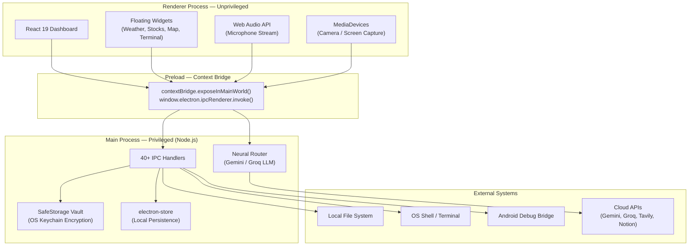

### Key Design Decisions

| Decision | Rationale |
| :--- | :--- |
| `sandbox: false` | Required for `nut-js` desktop automation and native module access |
| `webSecurity: false` | Required for cross-origin AI API calls from renderer dev server |
| `backgroundThrottling: false` | Voice/vision processing must continue when window is unfocused |
| Single-instance lock | Prevents multiple ELI instances from conflicting on IPC ports |

---

## Voice Command Pipeline

ELI uses Google's Gemini multimodal live API through a WebSocket connection. Audio is streamed in real-time from the browser's Web Audio API, and the model responds with both text and tool calls.

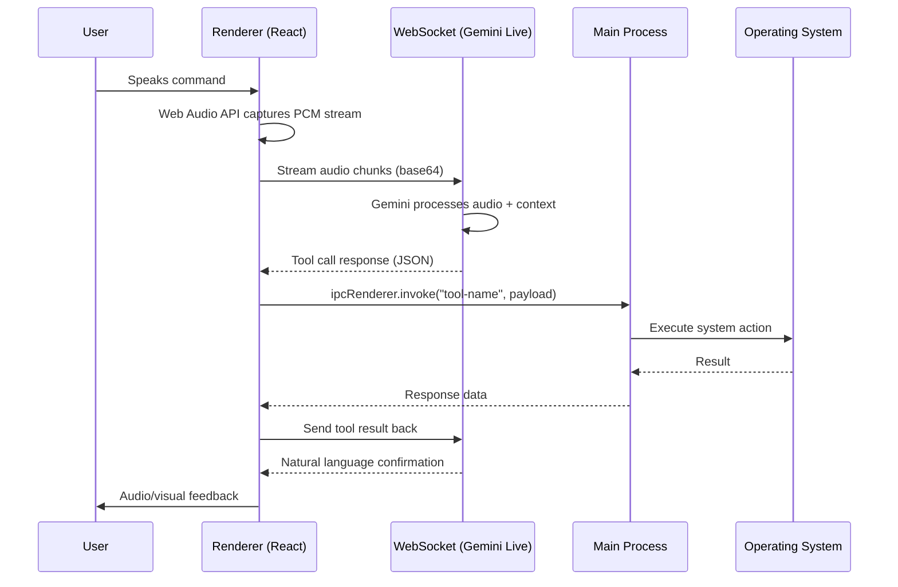

### Voice State Machine

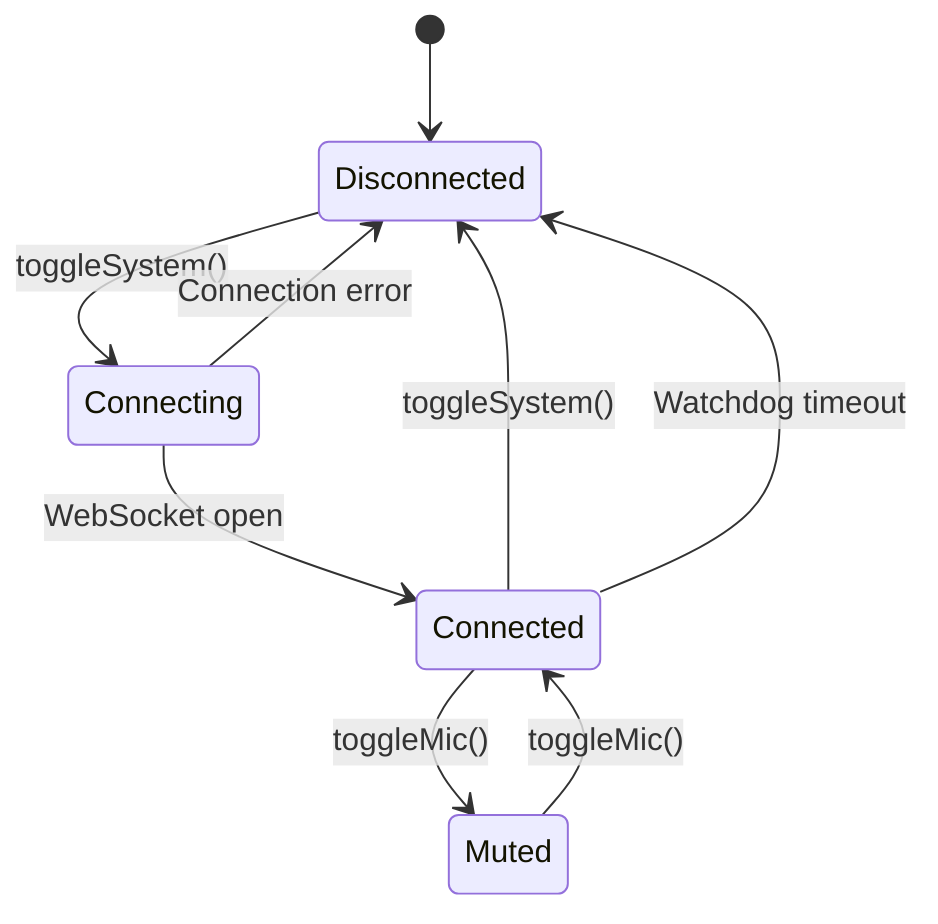

The **Watchdog** (`IndexRoot.tsx`) polls `eliService.isConnected` every 1 second. If the WebSocket drops silently, it resets the UI state and stops vision processing automatically.

---

## Vision & Screen Analysis

ELI captures and analyzes desktop content every 2 seconds when vision mode is active. Two modes are supported:

| Mode | Source | Use Case |
| :--- | :--- | :--- |
| `camera` | `getUserMedia({ video })` | Face recognition, object detection |
| `screen` | `desktopCapturer` → `getUserMedia` | UI analysis, OCR, screen understanding |

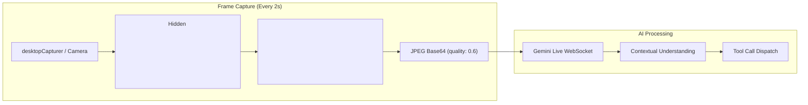

### Screen Peeler (OCR Pipeline)

For explicit OCR requests, the **Screen Peeler** handler captures the screen, runs Tesseract.js locally, and returns structured text:

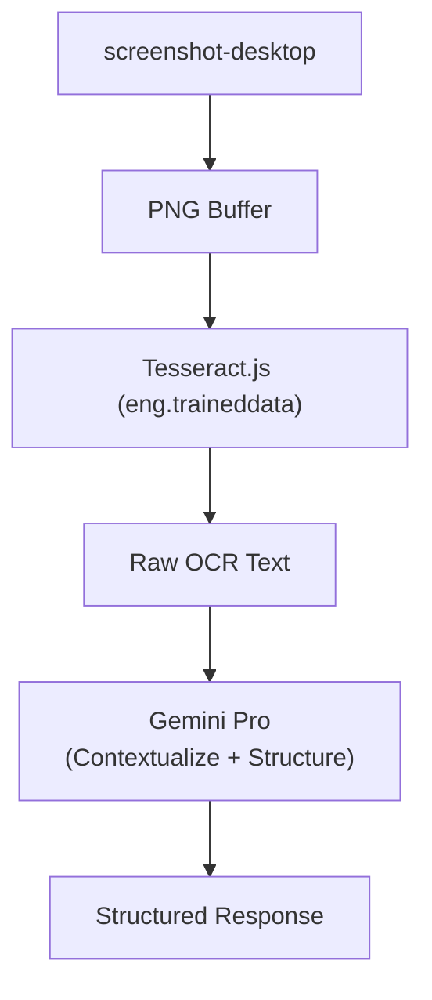

---

## Mobile Telekinesis (ADB)

ELI controls Android devices through a TCP/IP ADB bridge. All commands route through `child_process.exec()` in the Main process.

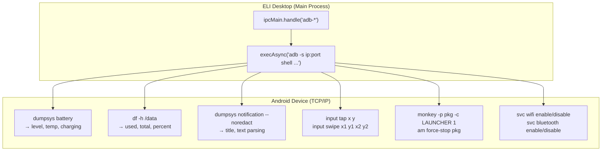

### Connection Flow

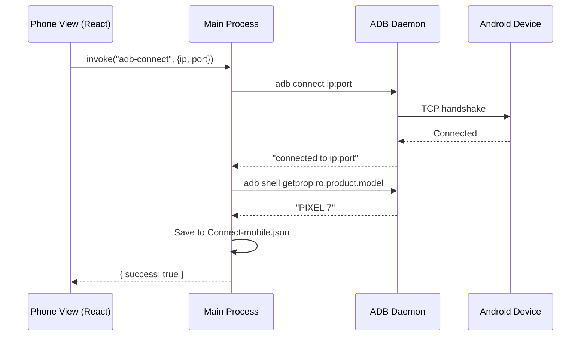

---

## Local RAG & Semantic Search

ELI implements a **hybrid search engine** that combines vector-semantic search with native filesystem crawling.

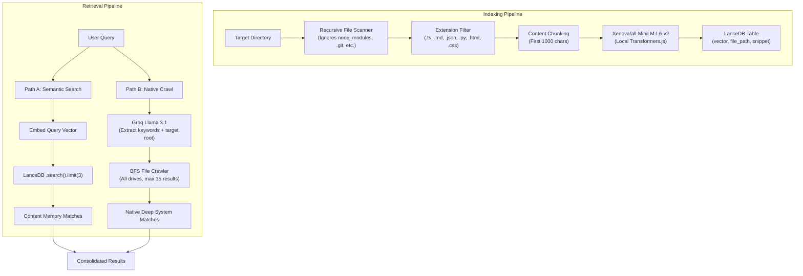

### Embedding Model

| Property | Value |
| :--- | :--- |
| Model | `Xenova/all-MiniLM-L6-v2` |
| Dimensions | 384 |
| Runtime | Transformers.js (ONNX, runs locally) |
| Pooling | Mean |
| Storage | LanceDB (Arrow-based columnar store) |

---

## Security & Vault Architecture

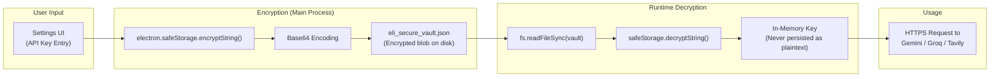

### Encryption Backends

| OS | Backend | Method |
| :--- | :--- | :--- |
| Windows | DPAPI | `CryptProtectData()` — tied to current Windows user profile |
| macOS | Keychain | `SecItemAdd()` — stored in login keychain |
| Linux | Secret Service | `gnome-keyring` or `kwallet` |

### Vault Lock (PIN / Biometric)

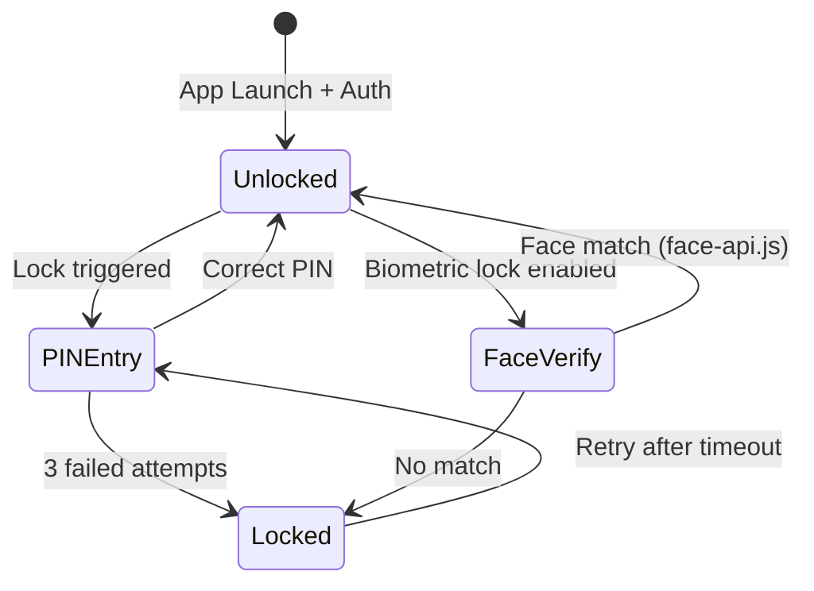

---

## Workflow Automation Engine

Workflows are stored as JSON graphs with **Nodes** (actions) and **Edges** (execution order). The visual editor uses React Flow.

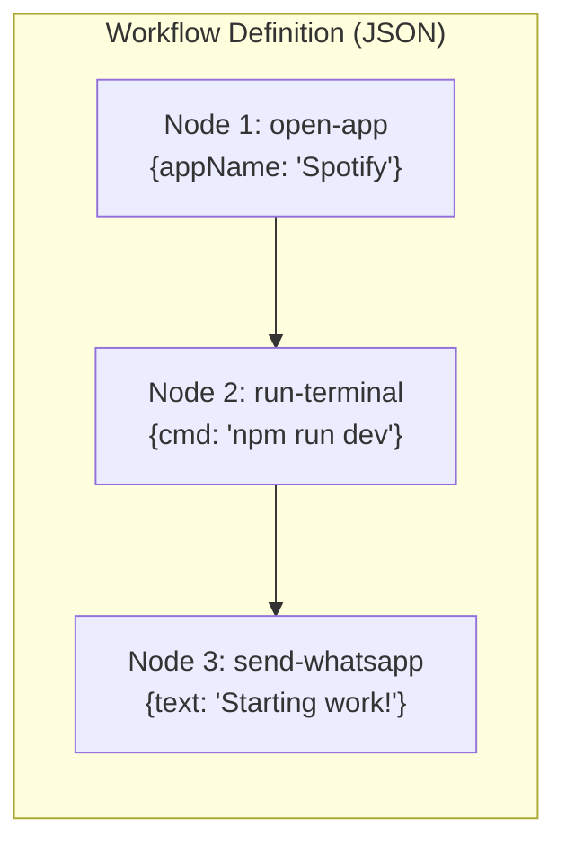

### Schema

```json
{
  "name": "Morning Routine",
  "description": "Auto-launch dev environment",
  "nodes": [
    { "id": "1", "type": "open-app", "data": { "appName": "VS Code" } },
    { "id": "2", "type": "run-terminal", "data": { "cmd": "cd ~/project && npm run dev" } }
  ],
  "edges": [
    { "source": "1", "target": "2" }
  ],
  "updatedAt": 1712345678000
}
```

Workflows are persisted to `eli_workflows.json` in the Electron `userData` directory.

---

## IPC Handler Reference

Complete list of registered `ipcMain.handle` channels:

### System & Files

| Channel | Source File | Payload | Purpose |
| :--- | :--- | :--- | :--- |
| `get-system-info` | `get-system-info.ts` | `void` | CPU, RAM, OS details |
| `open-application` | `app-launcher.ts` | `{ appName }` | Launch native app |
| `close-application` | `app-launcher.ts` | `{ appName }` | Kill process |
| `run-terminal` | `terminal-control.ts` | `{ command }` | Execute shell command |
| `read-file` | `file-read.ts` | `{ filePath }` | Read file contents |
| `write-file` | `file-write.ts` | `{ filePath, content }` | Write to disk |
| `manage-file` | `file-ops.ts` | `{ action, source, dest }` | Copy/move/delete |
| `open-file` | `file-open.ts` | `{ filePath }` | Open with default app |
| `read-directory` | `dir-load.ts` | `{ dirPath }` | List directory contents |
| `scan-files` | `file-launcher.ts` | `{ dirPath }` | Deep file scan |

### Search & Memory

| Channel | Source File | Payload | Purpose |
| :--- | :--- | :--- | :--- |
| `index-folder` | `file-search.ts` | `{ folderPath }` | Vectorize directory into LanceDB |
| `search-files` | `file-search.ts` | `{ query, groqKey }` | Hybrid semantic + native search |
| `save-memory` | `ELI-memory-save.ts` | `{ data }` | Save conversation memory |
| `load-memory` | `ELI-memory-save.ts` | `void` | Retrieve conversation memory |
| `save-note` | `notes-manager.ts` | `{ title, content }` | Create markdown note |
| `read-notes` | `notes-manager.ts` | `void` | List all saved notes |
| `save-permanent-memory` | `permanent-memory.ts` | `{ key, value }` | Persistent identity store |
| `get-permanent-memory` | `permanent-memory.ts` | `{ key }` | Retrieve identity data |

### AI Services

| Channel | Source File | Payload | Purpose |
| :--- | :--- | :--- | :--- |
| `google-search` | `web-agent.ts` | `{ query }` | Smart web search + scrape |
| `hack-website` | `reality-hacker.ts` | `{ url, mode }` | DOM injection/theme override |
| `ELI-coder` | `ELI-coder.ts` | `{ prompt }` | AI code generation |
| `deep-research` | `deep-research.ts` | `{ query }` | Multi-source autonomous research |
| `oracle-query` | `RAG-oracle.ts` | `{ query }` | Local codebase RAG |
| `oracle-ingest` | `RAG-oracle.ts` | `{ dirPath }` | Ingest codebase into vector DB |

### Mobile (ADB)

| Channel | Source File | Payload | Purpose |
| :--- | :--- | :--- | :--- |
| `adb-connect` | `adb-manager.ts` | `{ ip, port }` | Connect to Android device |
| `adb-disconnect` | `adb-manager.ts` | `void` | Disconnect device |
| `adb-telemetry` | `adb-manager.ts` | `void` | Battery, storage, model info |
| `adb-screenshot` | `adb-manager.ts` | `void` | Capture phone screen |
| `adb-tap` | `adb-manager.ts` | `{ xPercent, yPercent }` | Remote touch input |
| `adb-swipe` | `adb-manager.ts` | `{ direction }` | Remote swipe gesture |
| `adb-get-notifications` | `adb-manager.ts` | `void` | Scrape notification tray |
| `adb-push-file` | `adb-manager.ts` | `{ sourcePath, destPath }` | PC → Phone file transfer |
| `adb-pull-file` | `adb-manager.ts` | `{ sourcePath, destPath }` | Phone → PC file transfer |
| `adb-open-app` | `adb-manager.ts` | `{ packageName }` | Launch Android app |
| `adb-close-app` | `adb-manager.ts` | `{ packageName }` | Force-stop Android app |
| `adb-hardware-toggle` | `adb-manager.ts` | `{ setting, state }` | Toggle WiFi/BT/GPS/etc. |

### Desktop Automation

| Channel | Source File | Payload | Purpose |
| :--- | :--- | :--- | :--- |
| `ghost-control` | `ghost-control.ts` | `{ action, ...params }` | Mouse/keyboard automation (nut-js) |
| `screen-peeler-*` | `ScreenPeeler-handler.ts` | varies | OCR & screen-to-code |
| `phantom-*` | `PhantomControl-handler.ts` | varies | Global keyboard injection |
| `smart-dropzone-*` | `SmartDropZone-Handler.ts` | varies | Autonomous folder sorting |
| `telekinesis-*` | `telekinesis.ts` | varies | Window management |

### Security & Auth

| Channel | Source File | Payload | Purpose |
| :--- | :--- | :--- | :--- |
| `secure-save-keys` | `index.ts` | `{ groqKey, geminiKey }` | Encrypt + save API keys |
| `secure-get-keys` | `index.ts` | `void` | Decrypt + return API keys |
| `check-keys-exist` | `index.ts` | `void` | Check if vault file exists |
| `get-device-details` | `index.ts` | `void` | Device fingerprint (SHA-256) |
| `lock-system-*` | `lock-system.ts` | varies | PIN lock/unlock |
| `security-vault-*` | `Security.ts` | varies | Biometric lock (face-api.js) |
