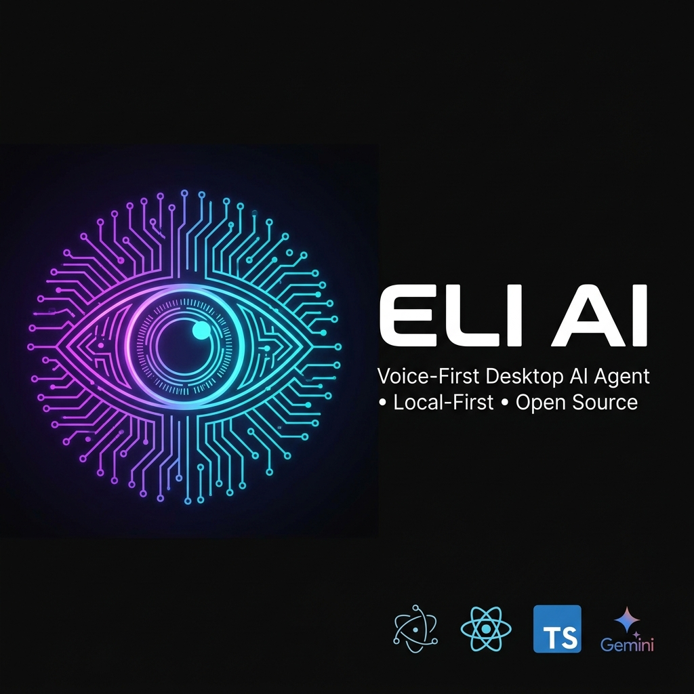
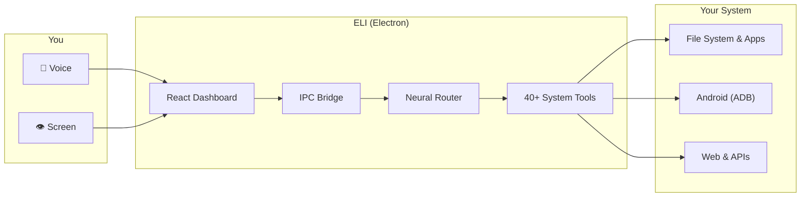

<div align="center">



# ELI AI

### 🧠 Voice-First Autonomous Desktop Agent

**Control your OS with voice. Automate workflows. Search files semantically. Remote-control your Android phone. All local-first, all open-source.**

[](https://github.com/krishrathi1/Next-Gen-Friend/actions/workflows/ci.yml)
[](https://opensource.org/licenses/MIT)
[](https://www.typescriptlang.org/)
[](https://www.electronjs.org/)
[](https://react.dev/)
[](https://deepmind.google/technologies/gemini/)
[](./CONTRIBUTING.md)

[Website](https://eliaiw.vercel.app) · [Architecture](./ARCHITECTURE.md) · [Features Guide](./FEATURES_GUIDE.md) · [Contributing](./CONTRIBUTING.md)

</div>

---

## 🚀 What is ELI?

ELI is an **open-source desktop AI agent** that executes real operating system actions through voice commands. Unlike chatbots that just generate text, ELI can:

- 🎤 **Listen** to your voice and understand intent in real-time via Gemini's multimodal live API
- 👁️ **See** your screen through OCR and vision AI to understand context
- ⚡ **Execute** system-level actions: open apps, manage files, run terminal commands, control your keyboard and mouse
- 📱 **Control your Android phone** remotely over ADB — tap, swipe, read notifications, toggle hardware
- 🔍 **Search your files semantically** using local vector embeddings (never leaves your machine)
- 🔄 **Automate complex workflows** with a visual node-based macro editor

> **Not a wrapper. Not a chatbot. A full OS execution layer.**

---

## 🏗️ Architecture Overview

ELI uses Electron's multi-process model to bridge AI intelligence with OS-level execution:



**[→ Full Architecture Deep-Dive with 10 Mermaid Diagrams](./ARCHITECTURE.md)**

---

## ✨ Feature Matrix

<table>
<tr>
<td width="50%">

### 🖥️ Desktop Automation
- Launch & terminate applications
- Execute terminal/shell commands
- Keyboard & mouse automation (nut-js)
- Window management & positioning
- Take screenshots & OCR screen content
- Volume control

</td>
<td width="50%">

### 📱 Mobile Telekinesis (ADB)
- Connect to Android over WiFi/USB
- Remote tap, swipe, and gesture control
- Read phone notifications on desktop
- Push/pull files between PC and phone
- Battery, storage, model telemetry
- Toggle WiFi, Bluetooth, GPS, flashlight

</td>
</tr>
<tr>
<td>

### 🧠 AI & Knowledge
- Voice-first interaction (Gemini Live)
- Screen vision & OCR (Tesseract.js)
- Semantic file search (LanceDB vectors)
- Deep research (Tavily + web crawling)
- Codebase RAG (Oracle mode)
- Local persistent memory

</td>
<td>

### 🔄 Automation & Workflows
- Visual macro editor (React Flow)
- Node-based workflow graphs
- Scheduled WhatsApp messages
- Email drafting & sending
- Smart Drop Zones (auto-sort folders)
- Wormhole (expose localhost publicly)

</td>
</tr>
<tr>
<td>

### 🌐 Web & Media
- Smart web search & summarization
- Stock price tracking & comparison
- Real-time weather data
- Interactive maps & navigation
- AI image generation
- Reality Hacker (DOM injection)

</td>
<td>

### 🔒 Security
- 100% BYOK (Bring Your Own Key)
- OS-native encryption (DPAPI/Keychain)
- PIN & face recognition lock
- Zero external key storage
- IPC-isolated execution model

</td>
</tr>
</table>

---

## 🛠️ Tech Stack

| Layer | Technologies |
| :--- | :--- |
| **Runtime** | Electron 39, Node.js 20+, TypeScript 5 |
| **Frontend** | React 19, Tailwind CSS 4, Framer Motion, GSAP, Three.js |
| **AI/ML** | Google Gemini Pro, Groq (Llama 3), Transformers.js, Tesseract.js, face-api.js |
| **Data** | LanceDB (local vectors), electron-store, Supabase (optional cloud auth) |
| **Automation** | nut-js (desktop), ADB (mobile), Puppeteer (web), child_process (shell) |
| **Build** | electron-vite, electron-builder (NSIS/MSI/DMG/AppImage) |

---

## ⚡ Quick Start

### Prerequisites
- Node.js 20+ ([download](https://nodejs.org/))
- npm 10+
- (Optional) ADB in PATH for phone features
- (Optional) API keys for Gemini/Groq

### Install & Run

```bash
# Clone
git clone https://github.com/krishrathi1/Next-Gen-Friend.git
cd Next-Gen-Friend

# Setup environment
cp .env.example .env
# Edit .env with your API keys (or add them later in Settings)

# Install & launch
npm install
npm run dev
```

### Build for Production

```bash
npm run build:win    # Windows (NSIS + MSI)
npm run build:mac    # macOS (DMG)
npm run build:linux  # Linux (AppImage, Snap, Deb)
```

---

## 🔑 Environment Variables

ELI uses `.env` for local development. In production, keys are entered through the Settings UI and encrypted via OS keychain.

| Variable | Required | Purpose |
| :--- | :--- | :--- |
| `VITE_SUPABASE_URL` | For auth | Supabase project URL |
| `VITE_SUPABASE_PUBLISHABLE_KEY` | For auth | Supabase anon key |
| `VITE_GEMINI_API_KEY` | Optional | Gemini API (dev fallback) |
| `MAIN_VITE_GROQ_API_KEY` | Optional | Groq/Llama 3 inference |
| `VITE_TAVILY_API_KEY` | Optional | Deep research agent |
| `VITE_NOTION_API_KEY` | Optional | Notion integration |
| `VITE_IMAGE_AI_API_KEY` | Optional | Image generation |

Full reference: [`.env.example`](./.env.example)

---

## 📁 Project Structure

```text
Next-Gen-Friend/
├── src/
│   ├── main/              # Electron Main Process (privileged)
│   │   ├── logic/         # 21 IPC handler modules (files, apps, ADB, search, etc.)
│   │   ├── handlers/      # Desktop automation (Screen Peeler, Phantom Control)
│   │   ├── services/      # AI services (RAG Oracle, Deep Research, Wormhole)
│   │   ├── security/      # Vault lock, biometric, PIN
│   │   ├── workflow/      # Workflow automation engine
│   │   ├── auto/          # Widget & website builders
│   │   └── index.ts       # Main entry — registers all 33 handler modules
│   ├── preload/           # Context bridge (secure IPC exposure)
│   └── renderer/          # React application
│       └── src/
│           ├── views/     # Dashboard, Settings, Phone, WorkFlowEditor, Gallery, Notes
│           ├── Widgets/   # 11 floating widgets (Weather, Stocks, Map, Terminal, etc.)
│           ├── components/ # Shared UI components
│           ├── services/  # Voice AI service, cloud auth
│           ├── store/     # Zustand + Immer state management
│           ├── tools/     # AI tool definitions
│           └── hooks/     # React hooks (desktop capture, etc.)
├── build/                 # Packaging assets (icons, NSIS config)
├── resources/             # App resources
├── supabase/              # Database schema
├── ARCHITECTURE.md        # Deep technical architecture docs
├── FEATURES_GUIDE.md      # UI feature walkthrough
├── PHONE_CONNECTION_GUIDE.md  # ADB setup guide
└── CITATION.cff           # Academic citation metadata
```

---

## 🗺️ Roadmap

- [x] Voice-first multimodal agent (Gemini Live)
- [x] Desktop automation suite (40+ tools)
- [x] Android remote control (ADB)
- [x] Local semantic search (LanceDB)
- [x] Visual workflow editor
- [ ] Plugin marketplace for community tools
- [ ] Multi-agent parallel task execution
- [ ] Local LLM fallback (Ollama integration)
- [ ] Linux/macOS full automation parity
- [ ] Neural memory graph visualization

---

## 🤝 Contributing

We welcome contributions! Please read our [Contributing Guide](./CONTRIBUTING.md) before submitting a PR.

**Quick links:**
- [Bug Reports](https://github.com/krishrathi1/Next-Gen-Friend/issues/new?template=bug_report.yml)
- [Feature Requests](https://github.com/krishrathi1/Next-Gen-Friend/issues/new?template=feature_request.yml)
- [Security Policy](./SECURITY.md)
- [Code of Conduct](./CODE_OF_CONDUCT.md)

---

## 📚 Documentation

| Document | Description |
| :--- | :--- |
| [ARCHITECTURE.md](./ARCHITECTURE.md) | Deep technical architecture with Mermaid diagrams |
| [FEATURES_GUIDE.md](./FEATURES_GUIDE.md) | Step-by-step UI feature walkthrough |
| [PHONE_CONNECTION_GUIDE.md](./PHONE_CONNECTION_GUIDE.md) | Android ADB setup & troubleshooting |
| [CONTRIBUTING.md](./CONTRIBUTING.md) | Contribution guidelines & PR process |
| [SECURITY.md](./SECURITY.md) | Security policy & threat model |
| [CODE_OF_CONDUCT.md](./CODE_OF_CONDUCT.md) | Community standards |

---

## 🔒 Security Note

ELI executes real system-level actions. Treat it as a privileged desktop runtime.

- API keys are encrypted via OS-native keychain (`safeStorage`)
- All system operations route through the IPC bridge (no direct renderer → OS access)
- Current dev config uses `webSecurity: false` and `sandbox: false` for compatibility — harden before production distribution

See the full [Security Policy](./SECURITY.md) and [Threat Model](./SECURITY.md#-ELI-trust--threat-model-critical).

---

## 📄 License

[MIT](./LICENSE) — Free for personal and commercial use.

---

<div align="center">


*If ELI helped you, consider giving it a ⭐ — it helps others discover this project.*

</div>
